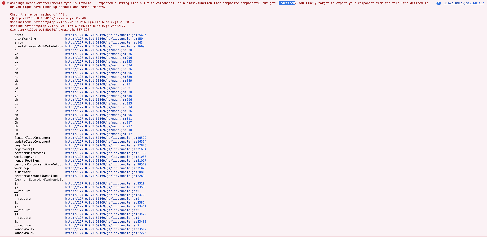

# Shadow-clj treeshaking issue reproduction

When using `:refer` to import javascript dependencies, and combined with nested dot syntax `root.nested`,
the compiled code in release mode seems to not be able to bridge with the library.

To visualize a simple page do `npm ci && npm run release`. To reproce the error, replace the app-shell component with the one commented out and run the release script again.

